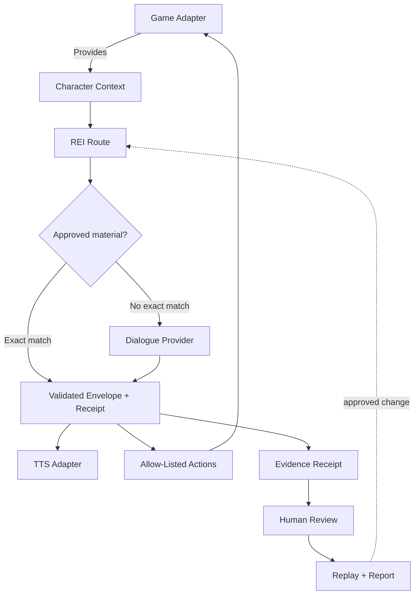

# REI EchoForge


**An evidence-driven character runtime for making legacy-game worlds more
responsive—without giving a language model unrestricted control of the game.**

EchoForge combines local dialogue models, reviewed lore, per-character memory,
generated speech, a deterministic game adapter, and C-Activity evidence loops.
Original Oblivion is the first proving ground; the runtime boundary is designed
to remain game-independent.

The intended player experience is simple:

1. Target a character in a supported game.
2. Press a hotkey and type a question.
3. Receive an in-character subtitle and spoken response.

## What works today

| Capability | Current evidence |
| --- | --- |
| Typed NPC conversation | Verified live in original Oblivion: aim, press `Y`, type, and receive an in-game response |
| Local grounded dialogue | Routed local Ollama models with structured output, exact fact keys, correction, and safe fallback |
| Fast reviewed dialogue | One accepted Nels family path uses approved prepared material with no live model call |
| Character voice selection | Exact Nels identity selects a reviewed local Piper voice; unmatched actors retain the default |
| Bounded memory | Per-character local memory supports relevant follow-ups without promoting generated text into lore |
| Bounded NPC action | Nels visibly performed a pickup gesture and the selected sweetroll entered his inventory |
| C-Activity flywheel | Live receipts can be classified, human-reviewed, promoted into replay candidates, replayed, and aggregated |

Audio still plays through desktop Piper rather than the NPC's spatial game-audio
source. The response UI is an xOBSE message box rather than a native subtitle.
The pickup experiment has not yet verified NPC locomotion to a distant item.
Broad NPC lore coverage, lip synchronization, companionship, and a second game
adapter remain future work.

## How the flywheel works

```text
play -> capture receipts -> classify observable signals -> human review
     -> local replay candidate -> regression replay -> evidence report
     -> separately approved improvement -> play again
```

Automatic output cannot approve itself, change routing, or execute a game
action. Human review and the deterministic adapter remain separate authority
boundaries.

## Run the vertical slice

Node.js 20 or newer is the only requirement for the game-independent demo and
test harness.

```bash
npm test
npm run check
npm run demo -- "Have you seen anything near the ruins?"
npm run voice -- "Have you seen anything near the ruins?"
```

The `voice` command uses the machine's installed Speech Dispatcher backend and
waits for playback to complete. It is a local plumbing test, not character voice
cloning; voice quality and alternative backends will be evaluated separately.

### Optional local neural voice

Piper runs locally but is installed separately under its GPL-3.0 license:

```bash
python3 -m venv .venv
.venv/bin/pip install piper-tts
mkdir -p .local/voices
.venv/bin/python3 -m piper.download_voices \
  --data-dir .local/voices en_US-lessac-medium \
  en_GB-northern_english_male-medium
npm run voice:neural -- "Have you seen anything near the ruins?"
```

The selected model and its metadata remain local and are excluded from Git.
Its model card identifies the source dataset and training provenance. Treat
commercial voice rights as a separate clearance question. The Northern English
male model's dataset is CC BY-SA 4.0, so EchoForge records attribution and
share-alike obligations with the local prototype. This prototype does not clone
a Bethesda performer.

### Optional local dynamic dialogue

Install Ollama and the local `qwen3:0.6b` and `qwen3:1.7b` models. The measured
0.32.15 CPU archive expands to approximately 2.1 GB; the model data remains in
the ignored local directory:

```bash
curl -fL https://ollama.com/download/ollama-linux-amd64.tar.zst \
  -o /tmp/rei-ollama-linux-amd64.tar.zst
mkdir -p .local/ollama
tar --zstd -xf /tmp/rei-ollama-linux-amd64.tar.zst -C .local/ollama
```

Start the temporary server, pull the model once, and then combine dynamic
dialogue with the neural voice:

```bash
# Terminal 1
npm run ollama:serve

# Terminal 2
.local/ollama/bin/ollama pull qwen3:1.7b
.local/ollama/bin/ollama pull qwen3:0.6b
npm run npc:local -- "Have you seen anything near the ruins?"
```

The dialogue adapter binds to Ollama's localhost API, disables model thinking,
requires structured output, limits supplied context, and preserves literal token
and duration metrics. A grounding gate requires relevant fact citations, retries
one invalid answer, and uses a safe uncertainty fallback if correction fails.
The current Mara profile and location are fictional test fixtures, not Oblivion
assets.

Keep the Ollama server in the foreground only for active tests and stop it with
`Ctrl+C` afterward. It is bound to localhost with cloud features disabled, but
Ollama 0.32.15 still advertises a broad built-in browser-origin allowlist. Do not
expose port `11434` or configure this prototype as a persistent service.

The demo provider is deterministic and offline. That makes the contract
testable before model, voice, and game integrations introduce nondeterminism.

## Prepare original Oblivion

The first game target is **The Elder Scrolls IV: Oblivion Game of the Year
Edition (2009)** on Steam, App ID `22330`. It is the original release, not
Oblivion Remastered.

Before installing any script extender or mod:

1. Install App ID `22330` through Steam.
2. Launch it once and reach the main menu.
3. Exit normally so Steam/Proton can create the game prefix and configuration.
4. Inspect and record the clean installation before adding xOBSE.

This preserves a reproducible baseline and separates Steam/Proton problems from
EchoForge adapter problems. Do not point the runtime at saves or grant a model
console access during this setup step.

### Build the first xOBSE bridge

With the 32-bit MinGW C++ compiler installed:

```bash
npm run bridge:build
npm run bridge:plugin
npm run bridge:fixture -- \
  --output=/absolute/Oblivion/Data/OBSE/Plugins/EchoForge/response.txt \
  "External response reached Oblivion."
```

Install the resulting ignored `.local/xobse/EchoForgeBridge.dll` in
`Data/OBSE/Plugins/` and `.local/oblivion/EchoForge.esp` in `Data/`, enable the
ESP, launch through xOBSE, and load a save. The plugin waits
120 game frames, reads at most 240 bytes, sanitizes script-significant
characters, and displays the response through xOBSE's supported `MessageBoxEX`
path. The initial EXP-008 display path registered no commands, performed no
network requests or game actions, and did not read or write save files. The
current bridge additionally exposes fixed targeting, question, and bounded
pickup hotkeys; it still exposes no arbitrary model or console-command API.

For the targeting proof, aim the crosshair at an NPC or creature and tap `U`
once. `F10` is also accepted, but was not detected on the measured ThinkPad
keyboard/Proton path. The plugin rejects empty and non-actor targets and never
disables or consumes either key. See EXP-009.

To see each selected identity arrive outside the game, start this before
launching Oblivion:

```bash
npm run target:listen
```

The listener automatically uses the measured Flatpak Steam installation path.
Set `ECHOFORGE_TARGET_PATH` or pass `--input=/absolute/path/target.json` for a
different installation. Each accepted `U` press atomically replaces one JSON
envelope. Schema v2 adds bounded, nullable game-derived actor and location names
plus the location Form ID; the reader remains strictly compatible with an
existing schema-v1 file during upgrade. The listener validates all fields and
emits a measured byte/hash receipt. See EXP-010 and EXP-013.

With the local Ollama server running, ask the currently selected actor one
bounded question and play the answer through Piper:

```bash
npm run npc:target -- "Who are you?"
```

The selected Form ID becomes the runtime character ID and remains attached to
the dialogue and voice receipts. Until canonical game names and dialogue facts
are imported, EchoForge uses an explicit generic actor label and the grounding
gate may return a cautious uncertainty response. Audio currently plays through
the computer, not from the NPC's in-game position. See EXP-011.

With schema v2, game-derived target names and locations become allow-listed
dialogue facts. In EXP-013, selecting `Nels the Naughty` inside `Summitmist
Manor` produced a grounded response that used those exact facts without
importing canonical dialogue. A strict profile overlay now matches only Nels's
exact Form ID and game-derived name, adds five short sourced fact paraphrases,
and selects `en_GB-northern_english_male-medium`. Deterministic retrieval selects
only the relevant reviewed facts. Exact approved profile/intent/fact-key matches
may use reviewed prepared wording; other turns retain local model generation.
Casual social turns route to `qwen3:0.6b`, grounded biography routes to
`qwen3:1.7b`, and unknown factual questions retain the uncertainty gate. Unknown
or mismatched actors keep the generic profile and default voice.

For a repeatable human-controlled loop, use one command:

```bash
npm run oblivion:session
```

The launcher starts or reuses the project-local model, waits for a `U`-selected
actor, accepts questions typed by the player, validates and speaks each answer,
and retains an ignored local JSONL session record. Each model response carries
an augmentation record alongside its in-character speech: `known` or
`unknown`, the exact supplied fact keys used, explicit uncertainty, retained
human control, and no model action authority. Commands are `/retarget`,
`/facts`, and `/quit`. See EXP-012 and the
[augmentation design](docs/AUGMENTATION_SYSTEM.md).

For the live in-game loop, start this before launching Oblivion:

```bash
npm run oblivion:live
```

Aim at an NPC or creature, press `Y`, type the question, and press Enter. The
runtime starts or reuses local Ollama, requires the question Form ID to match the
freshly exported target, speaks the validated response through Piper, atomically
publishes it back to the plugin, and retains a local JSONL evidence record.
Successful turns also enter an ignored local memory file keyed to the exact NPC
identity. At most four relevant/recent turns and 1,600 transcript characters
can enter a later prompt; canonical facts remain a separate evidence layer.

Every new spoken-turn record also carries a deterministic C-Activity
classification. It flags observable fallback, corrective validation, failed
voice playback, technical-language leakage, and dialogue/action authority
violations without pretending to score subjective character quality. A
human-accepted interaction can be promoted to a checked-in replay fixture. Run
the current replay corpus without launching Oblivion or playing audio:

```bash
npm run evidence:replay
```

The first fixture replays the accepted Nels family interaction through the
actual profile, prepared-material, routing, response, and voice-selection
boundaries. It verifies identity, fact use, grounding, route/provider, the
prepared-path latency ceiling, selected voice, prohibited system language, and
zero model action authority. Live audio quality and gameplay behavior remain
human-observed measurements rather than replay claims.

Review recorded play with:

```bash
npm run evidence:review -- --reviewer=aaron
```

The queue starts with the newest session and shows the question, response,
grounding support, route, measured dialogue and voice latency, selected voice,
and automatic warning signals. Accepting creates an ignored candidate under
`.local/replay-candidates`; rejecting requires a lore, voice, latency,
character, relevance, safety, or other flag. Skipping records nothing, and no
candidate enters the checked-in replay corpus automatically.

Summarize the accumulated evidence without changing policy:

```bash
npm run evidence:report
```

This writes ignored JSON and Markdown reports under `.local/evidence`. The
report keeps human rejection flags separate from automatic heuristics, states
the reviewed/total denominator, exposes duplicate or orphan records, and
calculates nearest-rank latency distributions from receipts explicitly marked
`measured`. It has no routing or execution authority.

### Try the bounded pickup action

With the bridge DLL and `EchoForge.esp` installed and enabled:

1. Aim at an NPC and press `U` to link that exact reference.
2. Aim at an ordinary ingredient and press `I`.
3. Read the in-game result and inspect the NPC inventory.

The adapter—not the language model—checks exact identities, actor availability,
same-cell distance, item type, ownership/off-limits state, quest/protected
flags, and reachability. It then owns the movement, animation, transfer, and
verification state machine. One nearby Nels/sweetroll run visibly queued the
pickup gesture and placed the item in Nels's inventory. A later pathfinding
candidate adds a temporary EchoForge-owned movement package, but actual walking
has not yet been observed and is not claimed.

## Architecture



Adapter direction:

- Experimental original Oblivion adapter through xOBSE
- Fallout 3 through FOSE or a separately evaluated Tale of Two Wastelands path
- Local and hosted dialogue models selected by measurable cost/latency needs
- Local speech recognition and consent-safe text-to-speech voices

## Project records

- [Project charter](docs/PROJECT_CHARTER.md) — purpose, users, claims, and scope
- [Architecture](docs/ARCHITECTURE.md) — trust boundaries and component map
- [Roadmap](docs/ROADMAP.md) — falsifiable milestones
- [Experiment log](docs/EXPERIMENT_LOG.md) — measured facts and observations
- [Activity ledger](docs/ACTIVITY_LEDGER.md) — effort converted into capability
- [Augmentation design](docs/AUGMENTATION_SYSTEM.md) — human control and A/B/C improvement model
- [Character material pipeline](docs/CHARACTER_MATERIAL_PIPELINE.md) — reviewed preparation and immediate delivery
- [Voice and rights](docs/VOICE_AND_RIGHTS.md) — licensing and consent boundaries

## Boundaries

- No Bethesda assets, dialogue, or voice recordings are included.
- Do not clone or distribute a person's voice without permission.
- Language models may propose actions; only a game adapter may validate and
  execute an allow-listed action.
- Measurements are reported as measurements, not promotional estimates.

## Status

Experimental pre-alpha. The original-Oblivion typed conversation loop, one
profiled/prepared Nels lore path, local voice selection, bounded persistent
memory, and one nearby gesture-plus-inventory pickup have been observed in the
live game. The C-Activity layer records, reviews, replays, and aggregates
evidence outside the game.

This is not yet an every-NPC replacement dialogue system. Spatial audio, native
subtitles, lip synchronization, distant-item locomotion, companion behavior,
broad reviewed lore coverage, and transfer to Fallout remain incomplete or
unverified.
